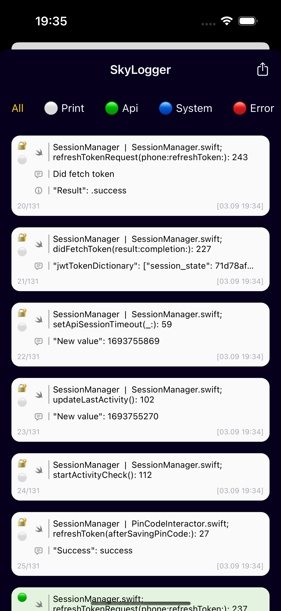
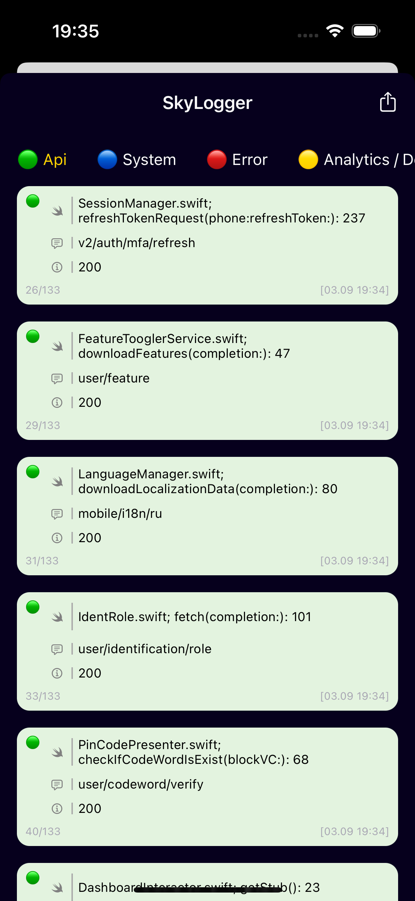
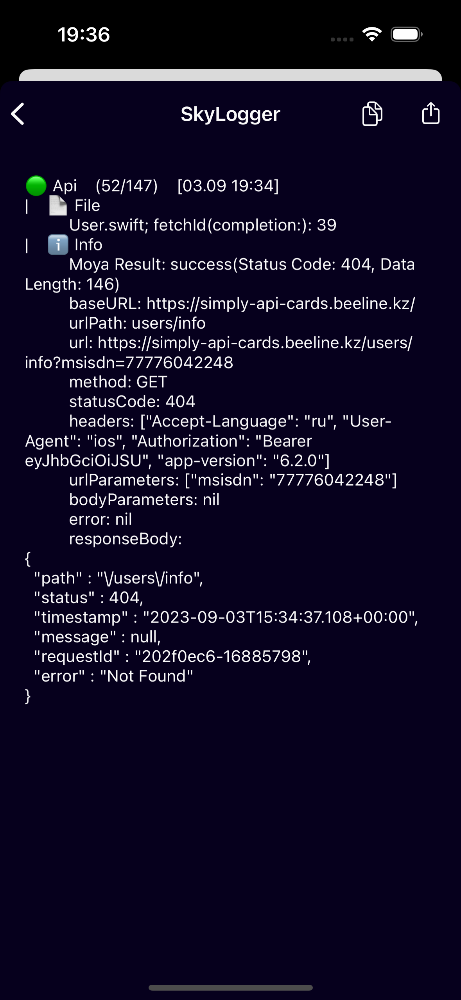
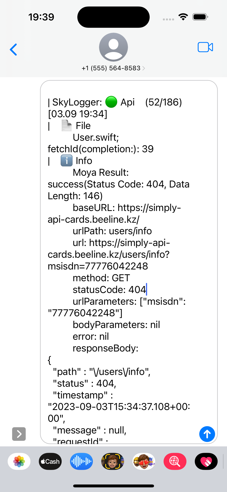
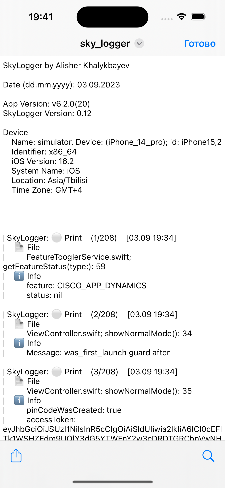

# SkyLogger
Библиотека для удобной записи и просмотра различных логов: принтов, ответа сервера, сообщений системы и кастомных сообщений.

# Скриншоты
  
 

# Описание

Библиотека предоставляет возможность записывать логи и просматривать их общий список, а так же делиться ими. Возможность делиться логами помогает в отладке и нахождении багов у тестировщиков или сотрудников, а возможность просмотра логов (без Xcode) в любой момент упрощает выявление ошибок.

Лог состоит из: названия файла и функции откуда произошел вызов, сообщения (опционально), массива параметров ключ-значение (опционально), времени вызова, категории лога.
Возможные категории:  

• Print (обычный print)  
• API (ответ сервера)  
• Error (сообщение об ошибке)  
• System (сообщение от системы)  
• Analytics / Debug (аналитика и дебаггинг)    
• Custom (кастомные, с отдельным ключом)  

В списке логов можно включить фильтрацию по категории.

При нажатии на лог можно увидеть его детальную информацию, копировать текст.

Есть возможность поделиться текстовым файлом со списком логов.

# CocoaPods
```ruby
pod 'SkyLogger', :git => "https://github.com/Alisher12398/SkyLogger"
```

# Основные команды

#### Конфигурация логгера в AppDelegate/SceneDelegate.

```swift
/// SkyCustomization пока не имеет параметров. Будут добавлены в будущем.
Logger.setup(appVersion: String, customization: SkyCustomization)
```

#### Запись лога.

```swift
/// Из UIViewController или UIView доступна быстрая команда
log(Log)

/// Из других файлов:
Logger.log(Log)
```

#### Создание объекта Log.
```swift
/// Есть множество convenience init для удобного и быстрого создания объекта лога
Log.init(logKind: Log.Kind, message: CustomStringConvertible?, parameters: [Log.Parameter]?, customKey: CustomKey?)
```

#### Быстрая команда замена для обычного Swift.print(). Создает лог с типом .print и введённым сообщением.  

```swift
/// Из UIViewController или UIView доступна быстрая команда
skyPrint(Any)

/// Из других файлов:
Logger.skyPrint(Any)
```

#### Отобразить список логов. 
```swift
Logger.presentLogList(navigationController: UINavigationController?)
```

#### Преобразовать объект в строку
```swift
Logger.convertObjectToString(Any)

/// Пример для чего полезна функция
let testClass = TestClass(name: "Test name", value: 10)

print("Swift.print: \(testClass)") // Swift.print: Example.TestClass
Logger.skyPrint(testClass) //Example.TestClass
Logger.skyPrint(Logger.convertObjectToString(testClass)) // Message: TestClass: name: Test name, value: 10.
```

### Пример в UIViewController
```swift
log(.init(kind: .system, message: "Test message", parameters: .init(key: "Test parameter", value: "Test parameter value")))
skyPrint("Print test message")
Logger.presentLogList(navigationController: navigationController)
```

#### Вот и всё необходимое🙃

## Дополнительные команды

##### Получить список логов в виде UIActivityViewController. Если не хотите использвать presentLogList().
```swift
Logger.getLogListShareViewController()
```

##### Поделиться файлом с логами
```swift
Logger.shareLogList(presentingViewController: UIViewController?)
```
